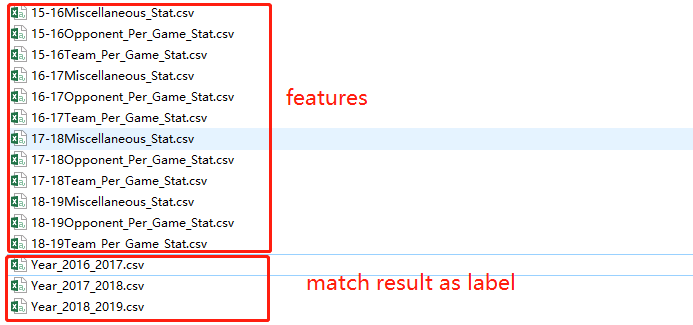
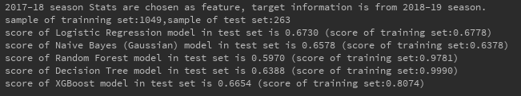

# NBA winner prediction
## dataset
The data set is downloaded from [basketball-reference.com](https://www.basketball-reference.com/). Choose `Seasons` and pick a season such as `2018-19`. Get `Team Per Game Stats`, `Opponent Per Game Stats` and `Miscellaneous Stats`, and save them as `cvs` file in `data` subpath.
Just like 
 
 
 
then the features can be create using those files. And match result label information can be got from `Schedule and Results`(as the same as studima200 offered). Save all results into `csv` file.

Please check './data/Year_2016_2017.csv', './data/Year_2017_2018.csv' and './data/Year_2018_2019.csv'.

Check `./data` subpath is like:

 
## model
Machine Learning method: Tecision Tree, Random Forest, XGBoost, Logistic Regression and Naive Bayes (Gaussian) are programmed in `studima200Project.py`. 
~~~python
python ./studima200Project.py
~~~
And an `.ipynb` file is offered to run this python script step by step. More modification sugesstions (shift feature file and label file) are also noted in that `.ipynb` file.

## result
result should be like:

Please note: Since data sets are shuffled randomly, and random process is also included in model trainning process, the result may be different in every trial.

## requirements
sklearn\
pandas\
numpy\
xgboost

## file history
|Date|Version|Comments|
|:--:|:--:|:--:|
|2019/12/9|V0.1|Init|