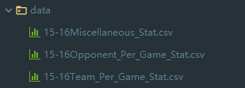

# NBA winnder prediction
## dataset
The data set is downloaded from [basketball-reference.com](https://www.basketball-reference.com/). Choose `Seasons` and pick a season such as `2018-19`. Get `Team Per Game Stats`, `Opponent Per Game Stats` and `Miscellaneous Stats`, and save them as `cvs` file in `data` subpath.
Just like 
 
 
 
then the features can be create using those files. And match result label information can be got from `Schedule and Results`. just save all results into one `csv` file and refine them.
Please check './data/2015-2016_result.csv'.
 
## model
    python ./NBAprediction.py
An result `csv` file will get base on `schedule` file. Logistic Regression method is implemented in this python file. Other models can be friendly built by sklearn package.

## ref
Chinese blog for more details:https://blog.csdn.net/moy37rqw1jarn33bgzk/article/details/80602924